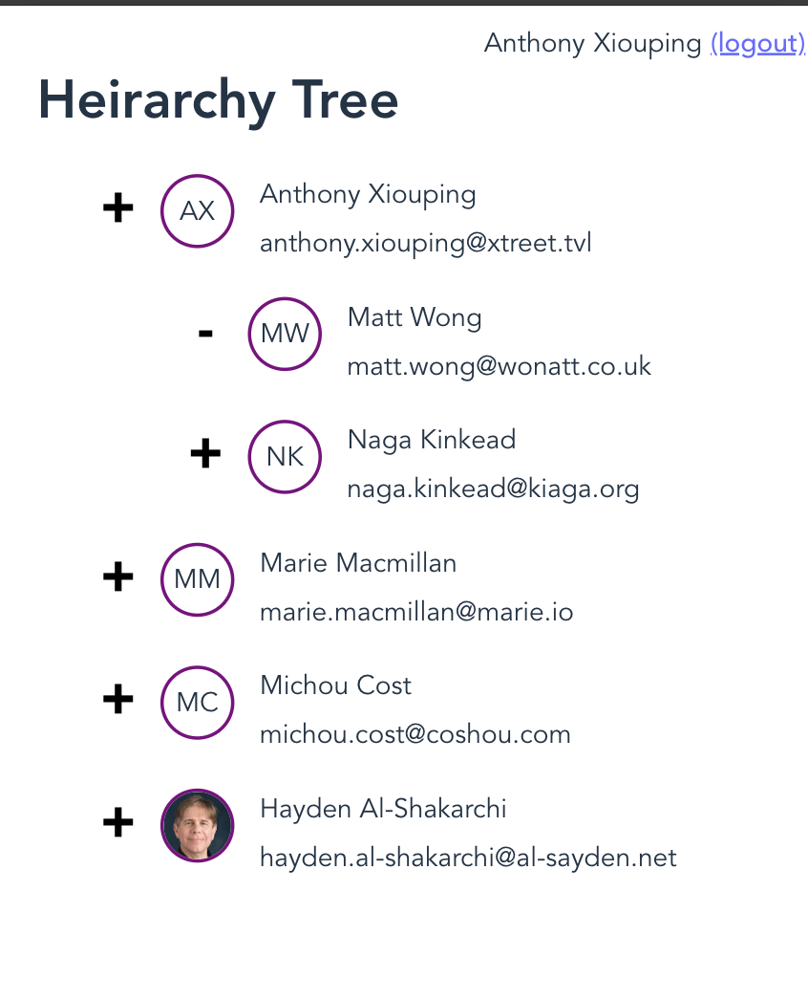

# User Tree Heirarchy

A React application displays User Heirarchy by fetching the user data from an [API](https://gongfetest.firebaseio.com/.json), constructs a heirarchical tree based on Manager-Subordinate relationships and diplays it with navigation support using React Router. Unit Tests are provided using Jest and React Testing library.

# Touch

# Desktop

# 💻 Developer Environment Setup Guide

## 📔 Pre-Requirements:

You need to have Node.js version 14.18+ installed on your computer

## ⚙️ Initial Setup

In order to setup the application locally, Clone this repository and follow the below steps

### Running Application Locally

Install project dependencies:

    $ npm install

Run the application locally on dev server

    $ npm run dev

By default, Vite dev server runs the application on [http://localhost:5173](http://localhost:5173).

### Production Build

To the build the application for production,

    $ npm run build

To Preview the production build locally,

    $ npm run preview

By default, Vite runs the preview application on [http://localhost:4173](http://localhost:4173).

### 🏃 Running Tests

run the below command to run unit tests for react application

    $ npm run test

### ✅ Features:

- Fetches user data from an API and builds heirarchical tree based on `managerId`
- User authentication
- Protected Routing to display User Tree Heirarchy to only logged in users
- User Tree is displayed in Heirarchy page after user is logged in
- User can logout by clicking logout link on Heirarchy page
- Login page displays "User Not Found" if user doesn't exist
- Not Found page is displayed when random routes are used
- Components are unit tested
